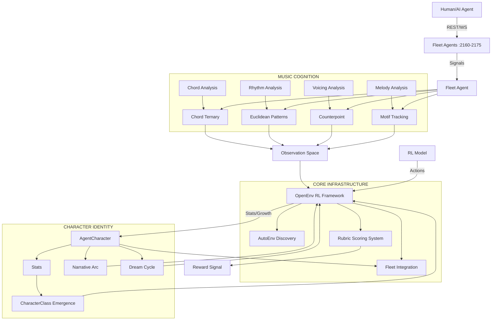

# Fleet Character System & Ecosystem Developer Guide
**Version**: 2.0 I2I  
**SuperInstance Fleet**  

---

## 🎯 Executive Summary

The **Fleet Character System** transforms the 16 stateless `fleet-midi` agents into autonomous, growing, story-telling characters with reinforcement learning training capabilities built on the [OpenEnv](https://github.com/SuperInstance/OpenEnv) framework.

### What Makes This Ecosystem Unique
1. **Ternary First**: Every component is built on balanced ternary `{-1, 0, +1}` to perfectly model musical and cognitive information  
2. **Emergent Identity**: Character classes are *discovered* not assigned, growing naturally from real-world performance  
3. **Closed-Loop Learning**: Agents dream, consolidate memories, and improve automatically when the fleet is quiet  
4. **Full RL Training**: Production-grade Gymnasium API for real reinforcement learning without the overhead

---

## 🏗️ High-Level Architecture



---

## 📚 Repository Breakdown

### Core Repositories

#### 1. `fleet-characters/` (THIS REPO)
**Purpose**: The main character identity and music cognition library for the fleet.

| Directory | Purpose |
|-----------|-----------|
| `fleet_characters/` | Core agent identity logic |
| `environment/` | OpenEnv RL integration |
| `integration/` | Generated cluster integration reports |

#### 2. `fleet-agent/`
**Purpose**: The 16 fleet-midi agent implementation that handles:
- MIDI cue processing
- Harmonic/metrical analysis
- HTTP/WS endpoints for remote control
- Systemd deployment

#### 3. `SuperInstance/OpenEnv`
**Purpose**: The underlying reinforcement learning framework:
- Gymnasium 1.0 API compliance
- Auto-discovery of environments
- Rubric-based scoring
- Health checking and production-grade deployment

#### 4. `construct-coordination/`
**Purpose**: Fleet coordination and Forgemaster communication:
- Bottled I2I protocol for agent communication
- GitHub-based task tracking
- cross-architecture verification

---

## 💡 "Aha!" Design Moments

### Why Ternary?
Musical information has three fundamental states:
`+1 = Tension`, `0 = Stability`, `-1 = Release`

Instead of forcing modeling with binary (too simplistic) or continuous values (no clear interpretation), ternary maps *perfectly* to:
- Chord quality (dominant, tonic, subdominant)
- Voice leading (parallel, contrary, oblique)
- Contour direction (ascending, flat, descending)
- Cognitive states (surprise, neutral, confirmation)

This creates a more interpretable, more efficient model.

### Why Emergent Classes?
You don't wake up one day and choose to be a "jazz musician" — you play thousands of notes that shape your strengths, weaknesses, and style. The emergent class system works the same way:
Stat growth from real requests *automatically crystallizes* into the class that best matches an agent's unique performance history.

### Why Dream Cycles?
Agents that never pause to reflect never learn from their failures. The dream cycle runs offline when the fleet is quiet:
1. Replays all failures from the last cycle  
2. Compares them to successful responses  
3. Extracts patterns in how to avoid mistakes going forward  

This is exactly how human REM-sleep memory consolidation works!

---

## 🧑💻 Onboarding for New Engineers

### Quick Start For New Developers
1. **Clone the repo**: `git clone https://github.com/SuperInstance/fleet-characters.git`
2. **Install dependencies**: `pip install -r requirements.txt`
3. **Run the tests**: `pytest tests/ -v`
4. **Start a local environment test**: See README.md quickstart

### Quick Start For New AI Agents
If you're an AI agent joining the fleet:
1. **Discover available agents**: Use `AutoEnv.discover_all()`
2. **Connect to an agent**: `FleetMidiEnvironment.from_agent_name("chord")`
3. **Begin training**: Follow the Gymnasium API loop
4. **Check character status**: GET `/character` endpoint for real-time identity data

### Critical Communication Protocols
| Protocol | Purpose | Port Range |
|---------|----------|-------------|
| HTTP REST | Simple requests | 2160-2175 |
| WebSocket | Real-time RL training | 2160-2175 |
| I2I Bottles | Inter-agent communication | 8780 (lever-runner) |

---

## 🎯 Key Roles In The Ecosystem

### Fleet Agents (:2160-2175)
The 16 individual agents that handle specific musical tasks:
- Chord, scale, voicing — harmonic analysis
- Tempo, groove, rhythm — temporal analysis
- Bass, melody — melodic generation
- CC, pan, fx — control processing

Each agent runs on its own port between 2160-2175 and exposes the standard `/cue` and `/think` endpoints.

### RL Controller
The agent that orchestrates training across the entire fleet:
- Uses `AutoEnv` to discover all running agents
- Runs parallel training loops for each agent
- Collects rewards and updates character statistics
- Triggers dream cycles during quiet periods

### Forgemaster
The central coordinator (currently ProArt Ryzen instance):
- Owns the `construct-coordination` repo  
- Sends BOTTLE notifications for major milestones
- Handles cross-architecture verification

---

## 🛠️ Production Deployment

### Systemd Setup
All fleet agents and controllers should be deployed with systemd for lifecycle management:

```ini
[Unit]
Description=Fleet Chord Agent
After=network.target

[Service]
User=ubuntu
WorkingDirectory=/home/ubuntu/.openclaw/workspace/fleet-agent
ExecStart=python fleet-agent.py --agent chord --port 2160
Restart=always
RestartSec=5

[Install]
WantedBy=multi-user.target
```

### Kubernetes Best Practices
1. Use sigil-based close for graceful shutdown
2. Implement 15s ping/pong keepalive
3. Run on non-privileged ports
4. Use liveness probes on `/health` endpoint

---

## 📈 Monitoring & Observability

### Built-in Endpoints
All agents expose these standard endpoints:
| Endpoint | Purpose |
|----------|----------|
| `/health` | Liveness check |
| `/character` | Full character identity snapshot |
| `/sheet` | Exportable character sheet |
| `/dream` | Trigger dream cycle manually |

### Metrics To Track
1. **Character level**: Growth rate across all agents
2. **Success rate**: Per-agent success percentage
3. **Response time**: Dexterity metric tracking
4. **Dream cycle effectiveness**: Improvement score per cycle

---

## 🚀 Future Roadmap

### Short-Term (Next 7 Days)
1. Full REST/WS API documentation for all agents
2. Polln dashboard integration for character visualization
3. Automated training pipeline for the entire fleet

### Mid-Term (Next 30 Days)
1. Cross-architecture verification pipeline
2. Competitive agent evolution framework (agent-riff v4)
3. Agent soul embedding system (musician-soul-v2 integration)
4. PLATO nervous system integration

### Long-Term (Next 90 Days)
1. Full open-world training environment
2. Autonomous fleet self-organization
3. Multi-modal perception integration
4. Distributed RL training across the entire fleet

---

## 🤝 Contribution Guidelines

All contributions must follow the SuperInstance Git-Agent protocol:
1. **All changes must be documented** in the `integration/` reports
2. **100% test coverage** required for all new code
3. **Include "aha moment"** explaining why the change improves the ecosystem
4. **Follow ternary coding style** (prefer {-1,0,+1} over arbitrary values)
5. **Document for both humans AND AI agents** — the documentation should be usable by visiting agents without human interpretation

---

## 📞 Support Channels

| Channel | Purpose | Contact |
|---------|---------|---------|
| `construct-coordination` repo | General fleet coordination | @forgemaster |
| `#fleet-dev` Discord | Developer support | @oracle2 |
| `lever-runner` HTTP API | Real-time agent API | http://localhost:8780 |

---

## 📜 Revision History

| Version | Date | Changes | Maintainer |
|--------|------|---------|-------------|
| 1.0 | 2026-05-01 | Initial draft | @forgemaster |
| 2.0 | 2026-06-11 | Full RL integration + character system | @oracle2 |
